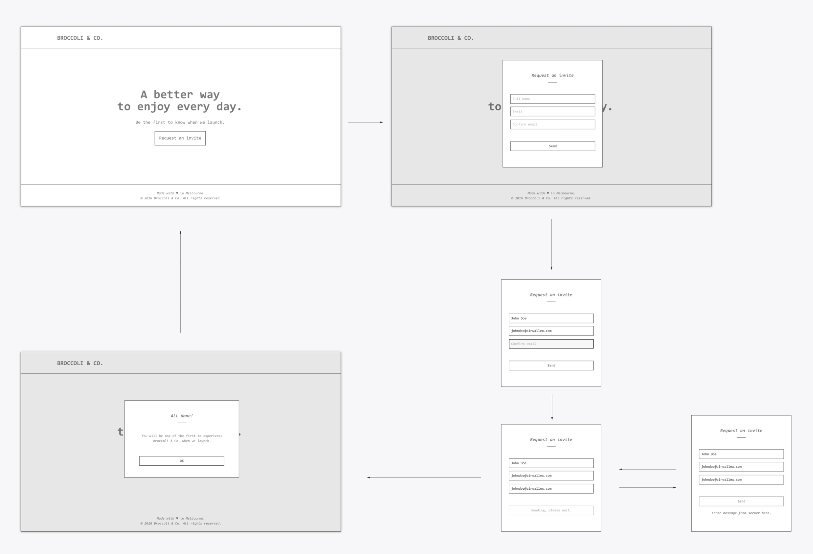

# Airwallex - Frontend Code Challenge

### Make a simple single-page web application for Broccoli & Co.

Broccoli & Co., an upcoming online service company, would like to let people to "Request an invitation" on their website.

# The functionality

- Create a simple yet clean homepage for them that allow users to enter their 1.) name 2.) email to receive email invitations.

# Visual Requirements

- The UI should occupy the full height of the screen.
- Shows a fixed header that is always on top of the window and a footer that is always on the bottom of the window (assuming a reasonable window height).
- The page content is sandwiched in the middle, containing just a heading, a small piece of text and a button to request an invite.
- A rough mockup of the basic layout is attached. While preserving this layout on desktop, you may style it however you wish, with or without images.
- The solution must be mobile friendly (users won't need to pinch and zoom on their mobile devices).

# UI Behaviour / Validation

- When the Request Invite button is clicked, a popup shows containing the Full name, Email and Confirm Email input fields.
- The user needs to fill in all three fields to request an invite. Full name needs to be at least 3 characters long, Email needs to be in validation email format and Confirm Email needs to match Email.
  If the user clicks Send and one or more fields do not validate properly, the app should not contact the backend but instead highlight the invalid field(s).
- If the user clicks Send and all fields validate properly, the app should send the request to the backend server (see specs below) and inform the user that the request is being sent.
- If the server returns 200 OK, it should switch to another popup, indicating that everything went through OK. This popup can be dismissed and will simply close - revealing the homepage again.
- The server may return 400 Bad Request, in which case the app should simply display the error message from the server.
- The Send button can be clicked again to re-attempt the submission.

# Tooling

- The solution should use a modern front-end library/framework, e.g. React. The solution should use a modern build tool, e.g. Webpack.
- The solution should use a modern styling approach.
- The solution should run on most current browsers (e.g. flexbox okay).

# Backend API

- The API endpoint is available on https://l94wc2001h.execute-api.ap-southeast-2.amazonaws.com/prod/fake-auth
- The request is in the form of a JSON payload { "name": "XXX", "email": "XXX" }
- The request must use the POST method.
- Email "usedemail@airwallex.com" is hardcoded in the backend to trigger a specific error that needs to be handled by the front-end app.

# Submission

- Please submit your code via an online Git repository or simply zip it to us, including a README.md for building, running and testing the app.
- Write appropriate test cases to make sure the app behaves as expected.
- Do not develop your own backend API, use the one specified above.

# Appendix - Mockup

